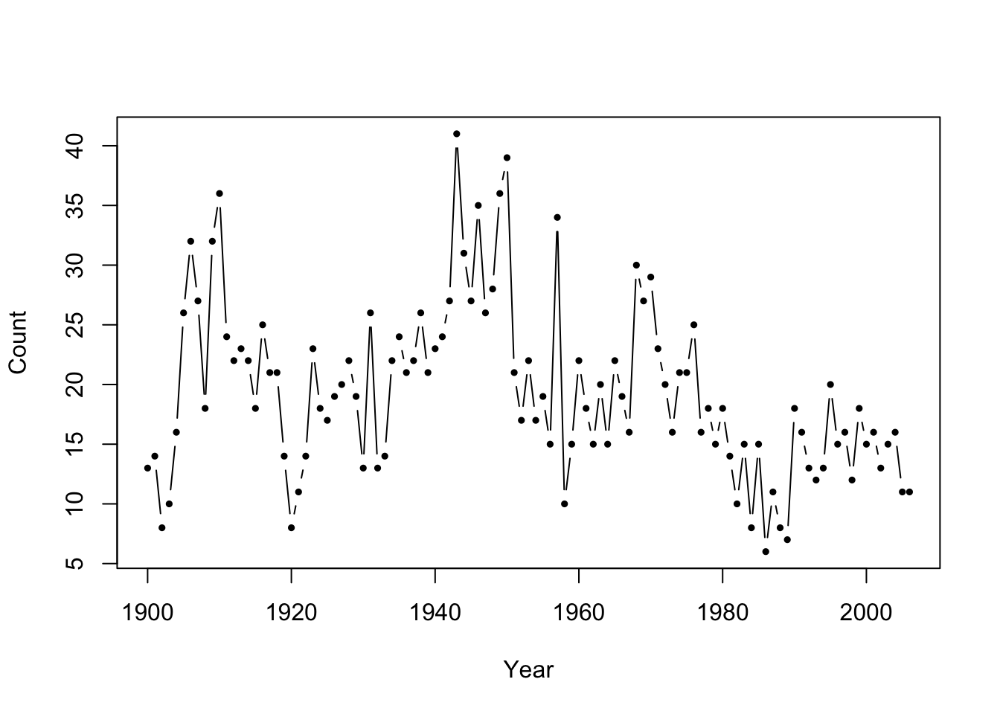
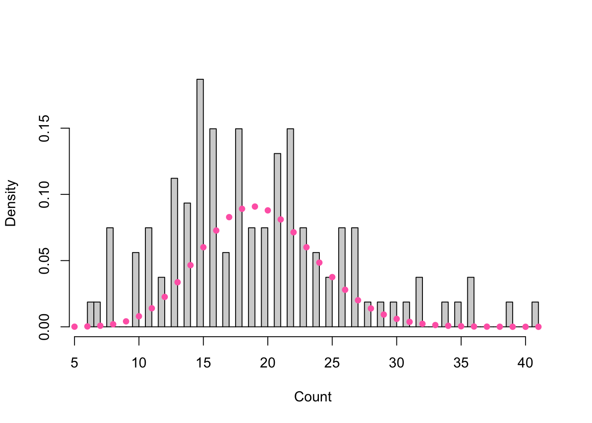
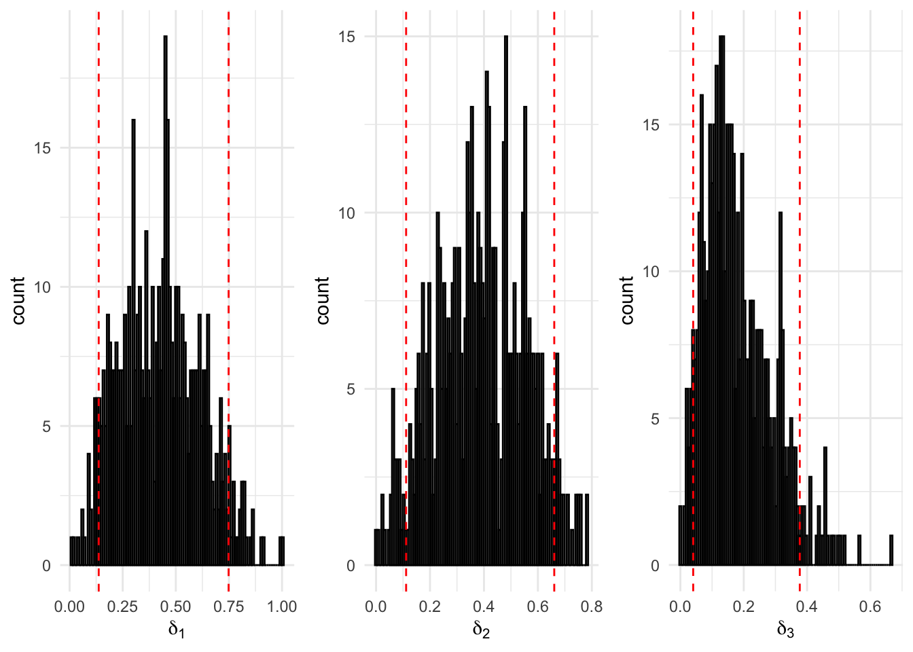
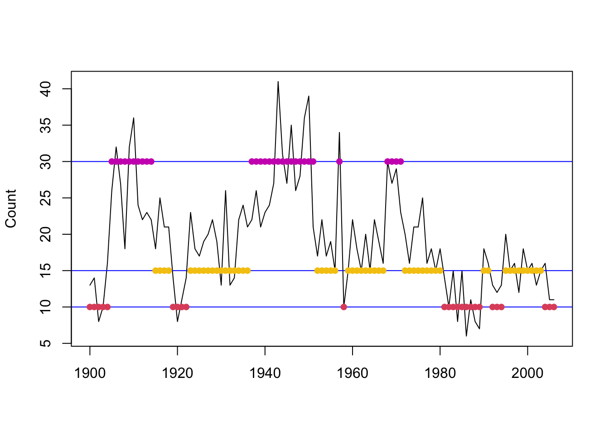
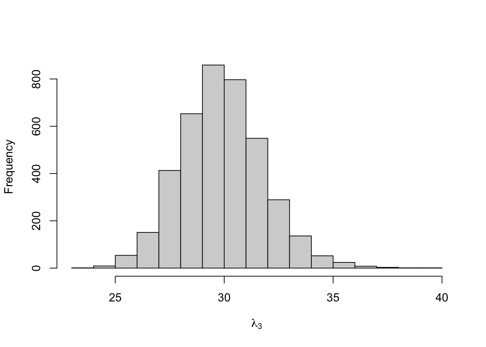

# Major Earthquake Analysis {#eq}

We apply the concepts in the earlier chapters to the series of annual counts of major earthquakes (i.e. magnitude 7 and above) dataset from the textbook. 

The data can be read into **R** 


```r
eq_dat <- read.table("http://www.hmms-for-time-series.de/second/data/earthquakes.txt")
```


<div class="figure">

<p class="caption">(\#fig:e1)Number of major earthquakes worldwide from 1900-2006.</p>
</div>

<div class="figure">

<p class="caption">(\#fig:e2)Histogram of major earthquakes overlaid with a Poisson density of mean equal to the observed counts.</p>
</div>

<table class=" lightable-minimal" style='font-family: "Trebuchet MS", verdana, sans-serif; margin-left: auto; margin-right: auto;'>
<caption>(\#tab:e4)Summary of the major earthquakes.</caption>
 <thead>
  <tr>
   <th style="text-align:right;"> mean </th>
   <th style="text-align:right;"> variance </th>
  </tr>
 </thead>
<tbody>
  <tr>
   <td style="text-align:right;"> 19.36 </td>
   <td style="text-align:right;"> 51.57 </td>
  </tr>
</tbody>
</table>


### Fitting a Poisson Mixture Distribution

**Note:** See [Preliminaries](#prelim)

We may consider fitting a Poisson mixture distribution since earthquake counts are unbounded and there appears to be overdispersion as evident by the multimodal peaks in Figure \@ref(fig:e2) and sample variance $s^2 \approx 52 > 19 \approx \bar{x}$ in Table \@ref(tab:e4). 

Suppose $m=3$ and the three components are Poisson-distributed with means $\lambda_1, \lambda_2$, and $\lambda_3$. Let $\delta_1$, $\delta_2$, and $\delta_3$ be the respective mixing parameters. The mixture distribution $p$ is given by

$$p(x) = \delta_1 \frac{\lambda_1^x e^{-\lambda_1}}{x!} + \delta_2 \frac{\lambda_2^x e^{-\lambda_2}}{x!} + \delta_3 \frac{\lambda_3^x e^{-\lambda_3}}{x!}$$

The likelihood is given by

$$L(\lambda_1, \lambda_2, \lambda_3, \delta_1, \delta_2|x_1, \dots, x_n) = \prod_{i=1}^n \left( \delta_1 \frac{\lambda_1^{x_i} e^{-\lambda_1}}{x_i!} + \delta_2 \frac{\lambda_2^{x_i} e^{-\lambda_2}}{x_i!} + (1 - \delta_1 - \delta_2) \frac{\lambda_3^{x_i} e^{-\lambda_3}}{x_i!} \right)$$

The log-likelihood can be maximized using an unconstrained optimizer `nlm` (in **R**) on reparameterized parameters by the following:

**Step 1**:  Reparameterize the "natural parameters" $\boldsymbol{\delta}$ and $\boldsymbol{\lambda}$ into "working parameters" $\eta_i = \log \lambda_i \qquad{(i = 1, \dots, m)}$ and $\tau_i = \log \left(\frac{\delta_i}{1 - \sum_{j=2}^m \delta_j}\right) (i = 2, \dots, m)$ 


```r
n2w <- function(lambda, delta)log(c(lambda, delta[-1]/(1-sum(delta[-1]))))
```

**Step 2**: Compute the negative log-likelihood using the working parameters


```r
mllk <- function(wpar, x){
  zzz <- w2n(wpar)
  -sum(log(outer(x, zzz$lambda, dpois)%*%zzz$delta))}
```

**Step 3**: Transform the parameters back into natural parameters


```r
w2n <- function(wpar){
  m <- (length(wpar)+1)/2
  lambda <- exp(wpar[1:m])
  delta <- exp(c(0, wpar[(m+1):(2*m-1)]))
  return(list(lambda=lambda, delta=delta/sum(delta)))}
```

Hence, for a Poisson mixture distribution with means $\lambda_1, = 10, \lambda_2 = 20, \lambda_3 = 25$ and probabilities $\delta_1 = \delta_2 = \delta_3 = \frac{1}{3}$, 


```r
x <- eq_dat$V2
wpar <- n2w(c(10, 20, 25), c(1,1,1)/3)
```


```r
w2n(nlm(mllk, wpar, x)$estimate)
```

we obtain the following parameter estimates

<table class=" lightable-minimal" style='font-family: "Trebuchet MS", verdana, sans-serif; margin-left: auto; margin-right: auto;'>
<caption>(\#tab:unnamed-chunk-8)Parameter estimates for the fitted three component Poisson independent mixture model.</caption>
 <thead>
  <tr>
   <th style="text-align:right;"> lambda </th>
   <th style="text-align:right;"> delta </th>
  </tr>
 </thead>
<tbody>
  <tr>
   <td style="text-align:right;"> 12.73573 </td>
   <td style="text-align:right;"> 0.2775329 </td>
  </tr>
  <tr>
   <td style="text-align:right;"> 19.78515 </td>
   <td style="text-align:right;"> 0.5928037 </td>
  </tr>
  <tr>
   <td style="text-align:right;"> 31.62940 </td>
   <td style="text-align:right;"> 0.1296634 </td>
  </tr>
</tbody>
</table>

and the negative log likelihood 


```r
nlm(mllk, wpar, x)$minimum
```

```
## [1] 356.8489
```


**Note:** See Table 1.2 and Figure 1.4 of the textbook for a comparison of fitted mixture models with varying number of components. 


### Fitting a Poisson-HMM by Numerical Maximization

**Note:** See [Introduction to Hidden Markov Models](#introhmm) and Appendix A of the textbook. 


<div class="figure">

<p class="caption">(\#fig:acf)Autocorrelation plot for major earthquakes.</p>
</div>

Instead of fitting an (independent) Poisson mixture distribution, we may consider fitting a Poisson-HMM to account for the strong, positive serial dependence as evident in Figure \@ref(fig:acf). 

**Step 1:** Reparameterize the "natural parameters" $\boldsymbol{\Gamma}, \boldsymbol{\lambda}$, and $\boldsymbol{\delta}$ to the "working parameters".

Set 
$$\eta_i = \log \lambda_i \qquad{(i = 1, \dots, m)}$$ 

$$\nu_{ij} = \begin{cases} 1 & \qquad{\text{for } i = j} \\ \log(\gamma_{ij}) & \qquad{\text{for } i \neq j} \end{cases}$$

$$\delta_i = \begin{cases} \log \left(\frac{(\delta_2, \dots, \delta_m)}{\delta_1}\right) & \qquad{\text{if not stationary}}\\ \text{NULL} & \qquad{\text{otherwise}} \end{cases}$$

See [Reparameterization to Avoid Constraints](#reparam). 


```r
pois.HMM.pn2pw <- function(m,lambda,gamma,delta=NULL,stationary=TRUE){ 
  
  # eta = log(lambda)
  tlambda <- log(lambda)
  if(m==1) return(tlambda)
 
  # For i = j, nu_ii = 1 
  foo     <- log(gamma/diag(gamma))
  
  # For i != j, nu_ij = log(gamma_ij)
  tgamma  <- as.vector(foo[!diag(m)])
  
  # If stationary, set to pi = null
  if(stationary) {tdelta  <- NULL}
  # Otherwise, pi = log((delta_2, ..., delta_m)/delta_1)
    else {tdelta <- log(delta[-1]/delta[1])}
 
  parvect <- c(tlambda,tgamma,tdelta)
  return(parvect)
}
```

**Note:** `pois.HMM.pn2pw` takes in arguments `m` number of states (numeric), `lambda` Poisson means (vector), `delta` initial probabilities, and `stationary` (`TRUE/FALSE`). By default, the MC is assumed to be stationary with the initial distribution equal to the stationary distribution. The function returns a vector containing the working parameters. 


**Step 2:** Compute the log-likelihood by the forward algorithm using the scaling strategy. 

The general algorithm is:

$w_1 \leftarrow \boldsymbol{\delta P} (x_1) \boldsymbol{1'};$ $\boldsymbol{\phi}_1 \leftarrow \boldsymbol{\delta P} (x_1);$ $l \leftarrow \log w_1$

for $t=2, 3, \dots, T$

\begin{align}
\boldsymbol{v} 
&\leftarrow \boldsymbol{\phi}_{t-1} \boldsymbol{\Gamma P} (x_t)\\
u & \leftarrow \boldsymbol{v 1'}\\
l &\leftarrow l + \log u\\
\boldsymbol{\phi}_t & \leftarrow \frac{\boldsymbol{v}}{u}
\end{align}


See [Scaling the Likelihood Computation](#likscale) and Note (4).


```r
pois.HMM.lforward <- function(x,mod){
  
  n             <- length(x)
  lalpha        <- matrix(NA,mod$m,n)
  
  # At time t=1
  foo           <- mod$delta*dpois(x[1],mod$lambda)
  sumfoo        <- sum(foo)
  lscale        <- log(sumfoo)
  foo           <- foo/sumfoo
  
  lalpha[,1]    <- lscale+log(foo)
  
  # For t > 1
  for (i in 2:n){
    foo          <- foo%*%mod$gamma*dpois(x[i],mod$lambda)
    sumfoo       <- sum(foo)
    lscale       <- lscale+log(sumfoo)
    foo          <- foo/sumfoo
    lalpha[,i]   <- log(foo)+lscale
    }
  return(lalpha)
}
```

**Note:** `pois.HMM.lforward` takes in arguments `x` data and `mod` list consisting of `m` states, `lambda` means for the Poisson state-dependent distribution, and `delta` initial probabilities. 

**Step 3:** Maximize the log-likelihood/Minimize the negative log-likelihood

The function `nlm` in **R** performs the minimization of any function using a Newton-type algorithm. In order to minimize the negative log-likelihood, we first write a function that compute the negative log-likelihood from the working parameters. The same forward algorithm scheme applies. 


```r
pois.HMM.mllk <- function(parvect,x,m,stationary=TRUE,...)
{
 if(m==1) return(-sum(dpois(x,exp(parvect),log=TRUE)))
 n        <- length(x)
 pn       <- pois.HMM.pw2pn(m,parvect,stationary=stationary)
 foo      <- pn$delta*dpois(x[1],pn$lambda)
 sumfoo   <- sum(foo)
 lscale   <- log(sumfoo)
 foo      <- foo/sumfoo
 for (i in 2:n)
   {
   if(!is.na(x[i])){P<-dpois(x[i],pn$lambda)}
     else {P<-rep(1,m)}
   foo    <- foo %*% pn$gamma*P
   sumfoo <- sum(foo)
   lscale <- lscale+log(sumfoo)
   foo    <- foo/sumfoo
   }
 mllk     <- -lscale
 return(mllk)
}
```


**Step 4**: Transform the parameters back into natural parameters. 

Set 

$$\hat{\lambda_i} = \exp(\hat{\eta_i}) \qquad{(i = 1, \dots, m)}$$

$$\hat{\gamma}_{ij} = \frac{\exp(\hat{\nu_{ik}})}{\sum_{k=1, k \neq i}^m\exp(\hat{\nu_ik})} \qquad{\text{for } (i, j = 1, \dots, m)}$$

$$\hat{\boldsymbol{\delta}} = \begin{cases} \boldsymbol{1} (\boldsymbol{I} - \hat{\boldsymbol{\Gamma}} + \boldsymbol{U})^{-1}& \qquad{\text{if stationary}}\\ \frac{(1, \exp(\hat{\delta_2}), \dots, \exp(\hat{\delta}_m))}{1 + \exp(\hat{\delta_2}) + \dots + \exp(\hat{\delta}_m)} & \qquad{\text{otherwise}} \end{cases}$$


```r
pois.HMM.pw2pn <- function(m,parvect,stationary=TRUE){
 lambda        <- exp(parvect[1:m])
 gamma         <- diag(m)
 if (m==1) return(list(lambda=lambda,gamma=gamma,delta=1))
 gamma[!gamma] <- exp(parvect[(m+1):(m*m)])
 gamma         <- gamma/apply(gamma,1,sum)
 if(stationary){delta<-solve(t(diag(m)-gamma+1),rep(1,m))}
   else {foo<-c(1,exp(parvect[(m*m+1):(m*m+m-1)]))
   delta<-foo/sum(foo)}
 return(list(lambda=lambda,gamma=gamma,delta=delta))
}
```

**Note:** `pois.HMM.pw2pn` takes in arguments `m` number of states, `parvect` working parameters (vector), and `stationary` (`TRUE/FALSE`). By default, the MC is assumed to be stationary with the initial distribution equal to the stationary distribution. The function returns a list containing the natural parameters. 


Then putting everything together 


```r
pois.HMM.mle <- function(x,m,lambda0,gamma0,delta0=NULL,stationary=TRUE,...){
 parvect0  <- pois.HMM.pn2pw(m,lambda0,gamma0,delta0,stationary=stationary)
 mod       <- nlm(pois.HMM.mllk,parvect0,x=x,m=m,stationary=stationary)
 pn        <- pois.HMM.pw2pn(m=m,mod$estimate,stationary=stationary)
 mllk      <- mod$minimum
 np        <- length(parvect0)
 AIC       <- 2*(mllk+np)
 n         <- sum(!is.na(x))
 BIC       <- 2*mllk+np*log(n)
 list(m=m,lambda=pn$lambda,gamma=pn$gamma,delta=pn$delta,code=mod$code,mllk=mllk,AIC=AIC,BIC=BIC)
}
```

Hence, for a three-state Poisson-HMM with parameters $\boldsymbol{\lambda} = (10, 20, 25)$, $\boldsymbol{\Gamma} = \begin{pmatrix} 0.8 & 0.1 & 0.1\\ 0.1 & 0.8 & 0.1\\ 0.1 & 0.1 & 0.8 \end{pmatrix}$,

if we assume that the MC is stationary 


```r
eq_init <- list(m=3, 
            lambda=c(10, 20, 25), 
            gamma = matrix(c(0.8,0.1,0.1,0.1,0.8,0.1,0.1,0.1,0.8),3,3,byrow=TRUE),
            delta=c(1, 1, 1)/3
            )

(mod3s<-pois.HMM.mle(x,eq_init$m,eq_init$lambda,eq_init$gamma,stationary=TRUE))
```

```
## $m
## [1] 3
## 
## $lambda
## [1] 13.14573 19.72101 29.71437
## 
## $gamma
##              [,1]      [,2]       [,3]
## [1,] 9.546243e-01 0.0244426 0.02093313
## [2,] 4.976679e-02 0.8993673 0.05086592
## [3,] 1.504495e-09 0.1966420 0.80335799
## 
## $delta
## [1] 0.4436420 0.4044983 0.1518597
## 
## $code
## [1] 1
## 
## $mllk
## [1] 329.4603
## 
## $AIC
## [1] 676.9206
## 
## $BIC
## [1] 700.976
```

if we do not assume stationary and that $\boldsymbol{\delta} = (\frac{1}{3}, \frac{1}{3}, \frac{1}{3})$ 


```r
(mod3h <- pois.HMM.mle(x,eq_init$m,eq_init$lambda,eq_init$gamma,delta=c(1,1,1)/3,stationary=FALSE))
```

```
## $m
## [1] 3
## 
## $lambda
## [1] 13.13374 19.71312 29.70964
## 
## $gamma
##              [,1]       [,2]       [,3]
## [1,] 9.392937e-01 0.03209754 0.02860881
## [2,] 4.040106e-02 0.90643731 0.05316163
## [3,] 9.052023e-12 0.19025401 0.80974599
## 
## $delta
## [1] 9.999998e-01 8.700482e-08 8.281945e-08
## 
## $code
## [1] 1
## 
## $mllk
## [1] 328.5275
## 
## $AIC
## [1] 679.055
## 
## $BIC
## [1] 708.4561
```

We can also perform parameteric bootstrapping to obtain confidence intervals. 

**Note:** See [Obtaining Standard Errors and Confidence Intervals](#boot). 

**Step 1**: Fit the model


```r
eq_mle <- pois.HMM.mle(x,eq_init$m,eq_init$lambda,eq_init$gamma,delta=c(1,1,1)/3,stationary=FALSE)
```

**Step 2**: Generate a bootstrap sample from the fitted model.

The following function generates a sample from a Poisson-HMM of length `ns` from starting values `m` number of states, `lambda` means for the Poisson state-dependent distribution, and `delta` initial probabilities which are stored as `mod` (list).  


```r
pois.HMM.generate_sample  <- function(ns,mod){
 mvect                    <- 1:mod$m
 state                    <- numeric(ns)
 state[1]                 <- sample(mvect,1,prob=mod$delta)
 for (i in 2:ns) state[i] <- sample(mvect,1,prob=mod$gamma[state[i-1],])
 x                        <- rpois(ns,lambda=mod$lambda[state])
 return(x)
}
```


```r
boot_sample <- pois.HMM.generate_sample(length(x), eq_mle)
```


**Step 3**: Estimate parameters using the bootstrap sample.


```r
boot_mle <- pois.HMM.mle(boot_sample, eq_mle$m, eq_mle$lambda, eq_mle$gamma)
```

**Step 4**: Repeat (for a large) B times. 

Then putting everything together


```r
pois.HMM.boot <- function(B, x, m, lambda0, gamma0, delta0=NULL, stationary=TRUE){
  
  # Fit the model
  mod <- pois.HMM.mle(x, m, lambda0, gamma0, stationary=stationary)
  
  # Initialize
  bs_sample <- list()
  bs_mod <- list()
  
  # Generate B bootstrap samples
  for(i in 1:B){
    a = TRUE
    while(a){
      tryCatch({
        set.seed(i)
        bs_sample[[i]] <- pois.HMM.generate_sample(length(x), mod)
        bs_mod[[i]] <- pois.HMM.mle(bs_sample[[i]], m, mod$lambda, mod$gamma, mod$delta)
        a = FALSE
        },
        error=function(w){
          a = TRUE
        })
    }
    }
  return(bs_mod)
}
```

**Note:** Some errors would occasionally arise from solving the stationary distribution of bootstrap samples that may not have had a unique stationary distribution. To overcome this, the `tryCatch` function was used to throw out these problematic samples and regenerate a new sample. As there were at most two samples that resulted in the error, the generated bootstrap samples should still be representative of the dataset. 

Hence, 


```r
eq_boot <- pois.HMM.boot(500, x, eq_init$m, eq_init$lambda, eq_init$gamma)
```

and the $90\%$ confidence interval using the "percentile method"


```r
# Create dataframe for parameters from bootstrap samples
eq_lambda_boot <- sapply(eq_boot, "[[", 2)
eq_lambda_boot <- t(eq_lambda_boot)
eq_lambda_boot <- as.data.frame(eq_lambda_boot)

eq_gamma_boot <- sapply(eq_boot, "[[", 3)
eq_gamma_boot <- t(eq_gamma_boot)
eq_gamma_boot <- as.data.frame(eq_gamma_boot)

eq_delta_boot <- sapply(eq_boot, "[[", 4)
eq_delta_boot <- t(eq_delta_boot)
eq_delta_boot <- as.data.frame(eq_delta_boot)

# Obtain the 90% confidence interval
eq_boot_df <- t(cbind(sapply(eq_lambda_boot, quantile, probs=c(0.05, 0.95)),
                           sapply(eq_gamma_boot, quantile, probs=c(0.05, 0.95)),
                           sapply(eq_delta_boot, quantile, probs=c(0.05, 0.95)))) %>% 
  as.data.frame() 

rownames(eq_boot_df)[1:3] <- paste0("lambda", 1:3)
rownames(eq_boot_df)[4:6] <- paste0("gamma", 1, 1:3)
rownames(eq_boot_df)[7:9] <- paste0("gamma", 2, 1:3)
rownames(eq_boot_df)[10:12] <- paste0("gamma", 3, 1:3)
rownames(eq_boot_df)[13:15] <- paste0("delta", 1:3)


eq_boot_df %>%
  round(4) %>%
  kbl(caption="Bootstrap 90% Confidence Intervals for the parameters of the three-state HMM.") %>%
  kable_minimal(full_width=T)
```

<table class=" lightable-minimal" style='font-family: "Trebuchet MS", verdana, sans-serif; margin-left: auto; margin-right: auto;'>
<caption>(\#tab:unnamed-chunk-23)Bootstrap 90% Confidence Intervals for the parameters of the three-state HMM.</caption>
 <thead>
  <tr>
   <th style="text-align:left;">   </th>
   <th style="text-align:right;"> 5% </th>
   <th style="text-align:right;"> 95% </th>
  </tr>
 </thead>
<tbody>
  <tr>
   <td style="text-align:left;"> lambda1 </td>
   <td style="text-align:right;"> 11.8405 </td>
   <td style="text-align:right;"> 14.6116 </td>
  </tr>
  <tr>
   <td style="text-align:left;"> lambda2 </td>
   <td style="text-align:right;"> 16.9308 </td>
   <td style="text-align:right;"> 22.0249 </td>
  </tr>
  <tr>
   <td style="text-align:left;"> lambda3 </td>
   <td style="text-align:right;"> 19.4806 </td>
   <td style="text-align:right;"> 33.0097 </td>
  </tr>
  <tr>
   <td style="text-align:left;"> gamma11 </td>
   <td style="text-align:right;"> 0.8232 </td>
   <td style="text-align:right;"> 0.9880 </td>
  </tr>
  <tr>
   <td style="text-align:left;"> gamma12 </td>
   <td style="text-align:right;"> 0.0137 </td>
   <td style="text-align:right;"> 0.2132 </td>
  </tr>
  <tr>
   <td style="text-align:left;"> gamma13 </td>
   <td style="text-align:right;"> 0.0000 </td>
   <td style="text-align:right;"> 0.0000 </td>
  </tr>
  <tr>
   <td style="text-align:left;"> gamma21 </td>
   <td style="text-align:right;"> 0.0000 </td>
   <td style="text-align:right;"> 0.1162 </td>
  </tr>
  <tr>
   <td style="text-align:left;"> gamma22 </td>
   <td style="text-align:right;"> 0.6603 </td>
   <td style="text-align:right;"> 0.9637 </td>
  </tr>
  <tr>
   <td style="text-align:left;"> gamma23 </td>
   <td style="text-align:right;"> 0.0515 </td>
   <td style="text-align:right;"> 0.5534 </td>
  </tr>
  <tr>
   <td style="text-align:left;"> gamma31 </td>
   <td style="text-align:right;"> 0.0000 </td>
   <td style="text-align:right;"> 0.1108 </td>
  </tr>
  <tr>
   <td style="text-align:left;"> gamma32 </td>
   <td style="text-align:right;"> 0.0000 </td>
   <td style="text-align:right;"> 0.1908 </td>
  </tr>
  <tr>
   <td style="text-align:left;"> gamma33 </td>
   <td style="text-align:right;"> 0.4466 </td>
   <td style="text-align:right;"> 0.9485 </td>
  </tr>
  <tr>
   <td style="text-align:left;"> delta1 </td>
   <td style="text-align:right;"> 0.1370 </td>
   <td style="text-align:right;"> 0.7485 </td>
  </tr>
  <tr>
   <td style="text-align:left;"> delta2 </td>
   <td style="text-align:right;"> 0.1114 </td>
   <td style="text-align:right;"> 0.6606 </td>
  </tr>
  <tr>
   <td style="text-align:left;"> delta3 </td>
   <td style="text-align:right;"> 0.0404 </td>
   <td style="text-align:right;"> 0.3770 </td>
  </tr>
</tbody>
</table>

<div class="figure">

<p class="caption">(\#fig:boot)500 Bootstrap samples for the state-dependent parameters of the fitted three-state Poisson-HMM. The area within the red dotted lines correspond to the 90% confidence interval.</p>
</div>

<div class="figure">

<p class="caption">(\#fig:boot3)500 Bootstrap samples for the initial probabilities of the fitted three-state Poisson-HMM. The area within the red dotted lines correspond to the 90% confidence interval.</p>
</div>

<div class="figure">

<p class="caption">(\#fig:boot2)500 Bootstrap samples for the transition probabilities of the fitted three-state Poisson-HMM. The area within the red dotted lines correspond to the 90% confidence interval.</p>
</div>

We can also fit the three-state Poisson-HMM from the above using the `momentuHMM` package.


```r
library(momentuHMM)
colnames(eq_dat) <- c("year", "count")
```

The data must be converted into the `prepData` object to use `fitHMM`. 


```r
# Convert dataframe into prepData object
eq_prepped <- prepData(eq_dat,
                       coordNames = NULL,
                       covNames =  c("count"))

# Name the states
stateNames <- c("state1", "state2", "state3")

# Fit intercept only model
formula = ~ 1

eq_fit1 <- fitHMM(eq_prepped, 
               nbStates=3, 
               dist=list(count="pois"),
               Par0 = list(count = eq_init$lambda, delta=rep(1, 3)/3),
               formula = formula,
               stateNames = stateNames,
               stationary = FALSE)
eq_fit1
```

```
## Value of the maximum log-likelihood: -328.5884 
## 
## 
## count parameters:
## -----------------
##          state1   state2   state3
## lambda 13.13513 19.70822 29.70794
## 
## Regression coeffs for the transition probabilities:
## ---------------------------------------------------
##               1 -> 2    1 -> 3    2 -> 1   2 -> 3    3 -> 1    3 -> 2
## (Intercept) -3.42222 -3.520977 -3.119039 -2.83615 -28.60659 -1.448253
## 
## Transition probability matrix:
## ------------------------------
##              state1     state2     state3
## state1 9.414330e-01 0.03072828 0.02783867
## state2 4.007763e-02 0.90674107 0.05318130
## state3 3.052488e-13 0.19027062 0.80972938
## 
## Initial distribution:
## ---------------------
##       state1       state2       state3 
## 1.000000e+00 1.833456e-08 1.427794e-08
```

The resulting MLEs are very similar to that obtained from running the functions from above. 

A plot of the decoded states is shown below.


```r
plot(eq_fit1)
```

```
## Decoding state sequence... DONE
```


### Fitting a Poisson-HMM by the EM Algorithm 

**Note:** See [EM Algorithm (Baum-Welch)](#em)

Alternatively, we may obtain MLEs of the three-state Poisson HMM by the EM algorithm. 

**E-Step** Replace all quantities $v_jk (t)$, $u_j (t)$ by their conditional expectations given the observations $\boldsymbol{x}^(T)$ and current parameter estimates:

$$\hat{u}_j = \Pr (C_t = j|\boldsymbol{x}^{(T)}) = \frac{\alpha_t (j) \beta_t (j)}{L_T}$$

$${\hat{v}}_{jk} (t) = \Pr (C_{t-1} = j, C_t = k| \boldsymbol{x}^{(T)}) \frac{\alpha_{t-1} (j) \gamma_{jk} p_k (x_t) \beta_t (k)}{L_T}$$


**Step 1**: Compute the forward and backward probabilities.

We use the same forward algorithm from the above and apply the backward algorithm `pois.HMM.lbackward`. 

The general algorithm is:

$\boldsymbol{\phi}_T \leftarrow \frac{\boldsymbol{1}}{w_T}$; $l \leftarrow \log w_T$

for $t = T-1, \dots, 1$

\begin{align}
\boldsymbol{v} &\leftarrow \boldsymbol{\Gamma P} (x_{t+1}) \boldsymbol{\phi_{t+1}}\\
l &\leftarrow l + \log \boldsymbol{v}\\
u &\leftarrow \boldsymbol{v 1'}\\
\boldsymbol{\phi}_t &\leftarrow \frac{\boldsymbol{v}}{u}\\
l & \leftarrow l + \log u
\end{align}


```r
pois.HMM.lbackward<-function(x,mod){
 n          <- length(x)
 m          <- mod$m
 lbeta      <- matrix(NA,m,n)
 lbeta[,n]  <- rep(0,m)
 
 # For t = T
 foo        <- rep(1/m,m)
 lscale     <- log(m)
 
 # For t = (T-1),..., 1
 for (i in (n-1):1){
    foo        <- mod$gamma%*%(dpois(x[i+1],mod$lambda)*foo)
    lbeta[,i]  <- log(foo)+lscale
    sumfoo     <- sum(foo)
    foo        <- foo/sumfoo
    lscale     <- lscale+log(sumfoo)
  }
 return(lbeta)
}
```

**Note:** `pois.HMM.lbackward` takes in the same arguments as the `pois.HMM.lforward`. 

**Step 2:** Replace $u_j(t)$ by $\hat{u}_j (t)$ and  $v_{jk}(t)$ by $\hat{v}_{jk} (t)$.


```r
uhat <- function(x, mod){
  n <- length(x)
  m <- mod$m
  
  # Forward probabilities
  la <- pois.HMM.lforward(x, mod)
  
  # Backward probabilities
  lb <- pois.HMM.lbackward(x, mod)
  
  c <- max(la[,n])
  
  # L_T (with some constant amount)
  llk <- c + log(sum(exp(la[,n] - c)))
  
  # Initialize
  stateprobs <- matrix(NA, ncol=n, nrow=m)
  
  ## (a_t(j) b_t (j))/L_T 
  for(i in 1:n){
    stateprobs[,i] <- exp(la[, i] + lb[, i] - llk)
  }
  return(stateprobs)
}


vhat <- function(x, mod){
  n <- length(x)
  m <- mod$m
  
  # Forward probabilities
  la <- pois.HMM.lforward(x, mod)
  
  # Backward probabilities
  lb <- pois.HMM.lbackward(x, mod)
  
  # tpm
  lgamma <- log(mod$gamma)
  c <- max(la[, n])
  
  # L_T (with some constant amount)
  llk <- c + log(sum(exp(la[, n] - c)))
  v <- array(0, dim=c(m, m, n))
  px <- matrix(NA, nrow=mod$m, ncol=n)
  
  for(i in 1:n){
    px[, i] <- dpois(x[i], mod$lambda)
  }
  lpx <- log(px)
  
  for(i in 2:n){
    for(j in 1:mod$m){
      for(k in 1:mod$m){
        v[j, k, i] <- exp(la[j, i-1] + lgamma[j, k] + lpx[k, i] + lb[k, i] - llk)
      }
    }
  }
  return(v)
}
```


**Note:** The term `c` in the code is a constant added to the log-forward and log-backward probabilities to prevent numerical underflow. 

**M-Step** Maximize the complete data log-likelihood with respect to the parameter estimates, with functions of the missing data replaced by their conditional expectations.

That is, maximize

\begin{align}
\log \left(\Pr(\boldsymbol{x}^{(T)}, \boldsymbol{c}^{(T)}) \right) 
&= \sum_{j=1}^m \hat{u}_j (1) + \log \delta_j + \sum_{j=1}^m \sum_{k=1}^m \left(\sum_{t=2}^T \hat{v}_{jk} (t)\right) \log \gamma_{jk} + \sum_{j=1}^m \sum_{t=1}^T \hat{u}_j (t) \log p_j (x_t)
\end{align}

with respect to $\boldsymbol{\theta} = (\boldsymbol{\delta}, \boldsymbol{\Gamma}, \boldsymbol{\lambda})$. 

The maximizations of the parameters are given by 


```r
E_delta <- function(uhat){
  d <- uhat[, 1]
  return(d)
}


E_gamma <- function(vhat, mod){
  num <- apply(vhat, MARGIN=c(1, 2), FUN=sum)
  denom <- rowSums(num)
  g <- num/denom
  return(g)
}

E_pois_lambda <- function(x,mod,uhat){
 n <- length(x)
 m <- mod$m
 xx <- matrix(rep(x, m), nrow=m, ncol=n, byrow=TRUE)
 lambda_hat <- rowSums(uhat*xx)/rowSums(uhat)
 return(lambda_hat)
}
```


The `BaumWelch` function performs the EM algorithm by taking initial model parameters as inputs, then repeatedly fitting until convergence or the maximum number of iterations is reached (by default `maxit=50`). 


```r
BaumWelch <- function(x, m, lambda0, gamma0, delta0, maxit = 50){
  # Initial parameters
  mod_old <- list(m = m, lambda = lambda0, gamma = gamma0, delta = delta0)
  iter <- 1
  while(iter < maxit){
    # E-step
    u_hat <- uhat(x, mod_old)
    v_hat <- vhat(x, mod_old)
    
    # M-step
    delta_new <- E_delta(u_hat)
    gamma_new <- E_gamma(v_hat, mod_old)
    lambda_new <- E_pois_lambda(x, mod_old, u_hat)
    
    mod_old <- list(m=m, lambda=lambda_new, gamma=gamma_new, delta=delta_new)
    iter = iter + 1
  }
  mod <- list(m=m, lambda=lambda_new, gamma=gamma_new, delta=delta_new)
  return(mod)
}
```

Hence, for the three-state Poisson-HMM 


```r
# Fitting a three-state HMM
BaumWelch(x, eq_init$m, eq_init$lambda, eq_init$gamma, delta = rep(1, eq_init$m)/eq_init$m)
```

```
## $m
## [1] 3
## 
## $lambda
## [1] 13.13376 19.71316 29.70972
## 
## $gamma
##              [,1]       [,2]       [,3]
## [1,] 9.392939e-01 0.03209847 0.02860765
## [2,] 4.040172e-02 0.90643612 0.05316216
## [3,] 2.113508e-32 0.19025585 0.80974415
## 
## $delta
## [1]  1.000000e+00  3.977303e-84 2.817232e-235
```

### Forecasting, Decoding, and State Prediction

**Note:** See [Forecasting, Decoding, and State Prediction](#fdp).

#### Forecasting

The forecast probabilities $\Pr(X_{T+h} = x|\boldsymbol{X}^{(T)} = \boldsymbol{x}^{(T)})$ can be computed by 


```r
pois.HMM.forecast <- function(xf,h=1,x,mod)
{
 n        <- length(x)
 nxf      <- length(xf)
 dxf      <- matrix(0,nrow=h,ncol=nxf)
 foo      <- mod$delta*dpois(x[1],mod$lambda)
 sumfoo   <- sum(foo)
 lscale   <- log(sumfoo)
 foo      <- foo/sumfoo
 for (i in 2:n)
   {
   foo    <- foo%*%mod$gamma*dpois(x[i],mod$lambda)
   sumfoo <- sum(foo)
   lscale <- lscale+log(sumfoo)
   foo    <- foo/sumfoo
   }
  for (i in 1:h)
   {
   foo    <- foo%*%mod$gamma
   for (j in 1:mod$m) dxf[i,] <- dxf[i,] + foo[j]*dpois(xf,mod$lambda[j])
    }
 return(dxf)
}
```

**Note:** `pois.HMM.forecast` takes in arguments `xf` the range of $x$-values for the forecast probabilities, `h` the forecast horizon, `x` data, and  `mod` list consisting of `m` states, `lambda` means for the Poisson state-dependent distribution, and `delta` initial probabilities. 

For example, the forecast distributions for 1 to 4 years ahead with possible values up to 45 earthquakes is

<div class="figure">

<p class="caption">(\#fig:forecastfour)Forecast probabilities for the fitted three-state Poisson-HMM for 1 to 4 years ahead.</p>
</div>


#### Decoding

Local decoding can be computed using the forward and backward algorithms from above. Similar to computing $\hat{u}$ in the **E step** of the EM algorithm, the `pois.HMM.state_probs` computes the state probabilities then `pois.HMM.local_decoding` determines the most likely state at each time. 


```r
pois.HMM.state_probs <- function(x,mod)
{
 n          <- length(x)
 la         <- pois.HMM.lforward(x,mod)
 lb         <- pois.HMM.lbackward(x,mod)
 c          <- max(la[,n])
 llk        <- c+log(sum(exp(la[,n]-c)))
 stateprobs <- matrix(NA,ncol=n,nrow=mod$m)
 for (i in 1:n) stateprobs[,i]<-exp(la[,i]+lb[,i]-llk)
 return(stateprobs)
}

pois.HMM.local_decoding <- function(x,mod)
{
 n          <- length(x)
 stateprobs <- pois.HMM.state_probs(x,mod)
 ild        <- rep(NA,n)
 for (i in 1:n) ild[i]<-which.max(stateprobs[,i])
 ild
}
```

For example, local decoding for the three state Poisson-HMM is


```r
# Local decoding
(earthquake_local <- pois.HMM.local_decoding(x, eq_init))
```

```
##   [1] 1 1 1 1 1 3 3 3 3 3 3 3 3 3 3 2 2 2 2 1 1 1 1 2 2 2 2 2 2 2 2 2 2 2 2 2 2
##  [38] 3 3 3 3 3 3 3 3 3 3 3 3 3 3 3 2 2 2 2 2 3 1 2 2 2 2 2 2 2 2 2 3 3 3 3 2 2
##  [75] 2 2 2 2 2 2 2 1 1 1 1 1 1 1 1 1 2 2 1 1 1 2 2 2 2 2 2 2 2 2 1 1 1
```

<div class="figure">

<p class="caption">(\#fig:local)Local decoding for the three-state Poisson-HMM. The horizontal lines indicate the state-dependent means and the points indicate the decoded state at the given time.</p>
</div>

We can also perform local decoding using `momentuHMM`


```r
# Local decoding
## Compute state probabilities for each time step
state_probs <- stateProbs(eq_fit1)

## Select state that maximizes probability
local_vec        <- rep(NA,length(x))
for(i in 1:length(x)) local_vec[i] <- which.max(state_probs[i,])
local_vec
```

```
##   [1] 1 1 1 1 1 3 3 3 3 3 3 3 2 2 2 2 2 2 2 1 1 1 1 2 2 2 2 2 2 2 2 2 2 2 2 2 2
##  [38] 2 2 2 2 3 3 3 3 3 3 3 3 3 3 2 2 2 2 2 2 2 2 2 2 2 2 2 2 2 2 2 3 3 3 2 2 2
##  [75] 2 2 2 2 2 2 1 1 1 1 1 1 1 1 1 1 1 1 1 1 1 1 1 1 1 1 1 1 1 1 1 1 1
```

<div class="figure">

<p class="caption">(\#fig:comparelocal)Local decoding for the three-state Poisson-HMM. The horizontal lines indicate the state-dependent means and the points indicate the decoded state at the given time using  pois.HMM.local_decoding (purple) and momentuHMM (orange).</p>
</div>

Global decoding can be computed using the Viterbi algorithm 


```r
pois.HMM.viterbi<-function(x,mod)
 {
 n              <- length(x)
 xi             <- matrix(0,n,mod$m)
 foo            <- mod$delta*dpois(x[1],mod$lambda)
 xi[1,]         <- foo/sum(foo)
 for (i in 2:n)
  {
  foo<-apply(xi[i-1,]*mod$gamma,2,max)*dpois(x[i],mod$lambda)
  xi[i,] <- foo/sum(foo)
  }
 iv<-numeric(n)
 iv[n]     <-which.max(xi[n,])
 for (i in (n-1):1)
   iv[i] <- which.max(mod$gamma[,iv[i+1]]*xi[i,])
 return(iv)
}
```

For example, global decoding for the three state Poisson-HMM is 


```r
(earthquake_global <- pois.HMM.viterbi(x, eq_init))
```

```
##   [1] 1 1 1 1 1 3 3 3 3 3 3 3 3 3 3 3 3 3 3 1 1 1 1 2 2 2 2 2 2 2 2 2 2 2 2 2 2
##  [38] 2 3 3 3 3 3 3 3 3 3 3 3 3 3 2 2 2 2 2 2 2 2 2 2 2 2 2 2 2 2 2 3 3 3 3 2 2
##  [75] 2 2 2 2 2 2 2 1 1 1 1 1 1 1 1 1 1 1 1 1 1 2 2 2 2 2 2 2 2 2 2 1 1
```

<div class="figure">

<p class="caption">(\#fig:global)Global decoding for the three-state Poisson-HMM.</p>
</div>

<div class="figure">

<p class="caption">(\#fig:comparelg)Global (green) and local (brown) decoding for the three-state Poisson-HMM.</p>
</div>

The result of local and global decoding are very similar but not identical. 

Similarly, we can perform global decoding using `momentuHMM`


```r
(global_vec <- viterbi(eq_fit1))
```

```
##   [1] 1 1 1 1 1 3 3 3 3 3 3 2 2 2 2 2 2 2 2 1 1 1 1 2 2 2 2 2 2 2 2 2 2 2 2 2 2
##  [38] 2 2 2 2 2 3 3 3 3 3 3 3 3 3 2 2 2 2 2 2 2 2 2 2 2 2 2 2 2 2 2 3 3 3 2 2 2
##  [75] 2 2 2 2 2 2 2 1 1 1 1 1 1 1 1 1 1 1 1 1 1 1 1 1 1 1 1 1 1 1 1 1 1
```

```r
plotStates(eq_fit1)
```

```
## Decoding state sequence... DONE
## Computing state probabilities... DONE
```


<div class="figure">

<p class="caption">(\#fig:compareglobal)Global decoding for the three-state Poisson-HMM using  pois.HMM.gocal_decoding (purple) and momentuHMM (orange).</p>
</div>

There appears to be some differences between the results obtained from our function and from `momentuHMM`. 

**Note:** In both cases, the MC does not assume stationarity and the initial distribution is $\boldsymbol{\delta} = (1/3, 1/3, 1/3)$. 


#### State Predictions

The state prediction for $h$ steps ahead can be computed by 


```r
pois.HMM.state_prediction <- function(h=1,x,mod)
{
 n          <- length(x)
 la         <- pois.HMM.lforward(x,mod)
 c          <- max(la[,n])
 llk        <- c+log(sum(exp(la[,n]-c)))
 statepreds <- matrix(NA,ncol=h,nrow=mod$m)
 foo <- exp(la[,n]-llk)
 for (i in 1:h){
  foo<-foo%*%mod$gamma
  statepreds[,i]<-foo
  }
 return(statepreds)
}
```

For example, the state predictions for $h=1, \dots, 5$ is


```r
pois.HMM.state_prediction(h=5, x, eq_init)
```

```
##           [,1]      [,2]      [,3]      [,4]      [,5]
## [1,] 0.7733048 0.6413134 0.5489194 0.4842436 0.4389705
## [2,] 0.1259027 0.1881319 0.2316923 0.2621846 0.2835292
## [3,] 0.1007924 0.1705547 0.2193883 0.2535718 0.2775003
```

The stationary distribution is 


```r
# Compute stationary distribution
solve(t(diag(eq_init$m)-eq_init$gamma+1),rep(1,eq_init$m))
```

```
## [1] 0.3333333 0.3333333 0.3333333
```

Notice that as $h \rightarrow \infty$, the state distribution approaches the stationary distribution. 


## Bayesian Inference in STAN

We can fit the three-state Poisson-HMM to the earthquake data using R-STAN. 


```r
library(rstan)
library(bayesplot)
stan_data <- list(T=dim(eq_dat)[1], m=3, x=eq_dat$V2)
```


```r
pois.HMM.stan <- 
'data{
int<lower=0> m;                       // number of states
int<lower=1> T;                       // length of sequence
int<lower=0> x[T];                    // observations
}

parameters{
simplex[m] Gamma[m];                  // tpm
positive_ordered[m] lambda;           // ordered mean of state-dependent (prevent label switching)
}

transformed parameters{
  matrix[m, m] ta;                    // tpm used to compute stationary distribution                 
  simplex[m] statdist;                // stationary distribution

  for(j in 1:m){
    for(i in 1:m){
      ta[i, j] = Gamma[i, j];
    }
  }

//compute stationary distribution 
statdist =  to_vector((to_row_vector(rep_vector(1.0, m))/
      (diag_matrix(rep_vector(1.0, m)) - ta + rep_matrix(1, m, m))));
}

model{
  // initialise
  vector[m] log_Gamma_tr[m];
  vector[m] lp;
  vector[m] lp_p1;

  // priors
  lambda ~ gamma(0.1, 0.01);

  // transpose tpm and take log of entries
  for(i in 1:m)
    for(j in 1:m)
      log_Gamma_tr[j, i] = log(Gamma[i, j]);
    
  // forward algorithm
  // for t = 1
  for(i in 1:m)
    lp[i] = log(statdist[i]) + poisson_lpmf(x[1]|lambda[i]);
  
  // loop over observations
  for(t in 2:T){
  // loop over states
    for (i in 1:m)
      lp_p1[i] = log_sum_exp(log_Gamma_tr[i] + lp) + poisson_lpmf(x[t]|lambda[i]);
      
      lp = lp_p1;
   }
   target += log_sum_exp(lp);
  }
'
```

We first run 2000 iterations for each for each of the 4 chains, with the first 1000 draws drawn during the warm-up phase


```r
pois.HMM.stanfit <- stan(model_code = pois.HMM.stan, data = stan_data, refresh=2000)
```

```
## 
## SAMPLING FOR MODEL 'b37fb1f59e6ff956bdf58582435d9468' NOW (CHAIN 1).
## Chain 1: 
## Chain 1: Gradient evaluation took 0.00011 seconds
## Chain 1: 1000 transitions using 10 leapfrog steps per transition would take 1.1 seconds.
## Chain 1: Adjust your expectations accordingly!
## Chain 1: 
## Chain 1: 
## Chain 1: Iteration:    1 / 2000 [  0%]  (Warmup)
## Chain 1: Iteration: 1001 / 2000 [ 50%]  (Sampling)
## Chain 1: Iteration: 2000 / 2000 [100%]  (Sampling)
## Chain 1: 
## Chain 1:  Elapsed Time: 0.8606 seconds (Warm-up)
## Chain 1:                0.548921 seconds (Sampling)
## Chain 1:                1.40952 seconds (Total)
## Chain 1: 
## 
## SAMPLING FOR MODEL 'b37fb1f59e6ff956bdf58582435d9468' NOW (CHAIN 2).
## Chain 2: 
## Chain 2: Gradient evaluation took 5.6e-05 seconds
## Chain 2: 1000 transitions using 10 leapfrog steps per transition would take 0.56 seconds.
## Chain 2: Adjust your expectations accordingly!
## Chain 2: 
## Chain 2: 
## Chain 2: Iteration:    1 / 2000 [  0%]  (Warmup)
## Chain 2: Iteration: 1001 / 2000 [ 50%]  (Sampling)
## Chain 2: Iteration: 2000 / 2000 [100%]  (Sampling)
## Chain 2: 
## Chain 2:  Elapsed Time: 0.784481 seconds (Warm-up)
## Chain 2:                0.522786 seconds (Sampling)
## Chain 2:                1.30727 seconds (Total)
## Chain 2: 
## 
## SAMPLING FOR MODEL 'b37fb1f59e6ff956bdf58582435d9468' NOW (CHAIN 3).
## Chain 3: 
## Chain 3: Gradient evaluation took 5.9e-05 seconds
## Chain 3: 1000 transitions using 10 leapfrog steps per transition would take 0.59 seconds.
## Chain 3: Adjust your expectations accordingly!
## Chain 3: 
## Chain 3: 
## Chain 3: Iteration:    1 / 2000 [  0%]  (Warmup)
## Chain 3: Iteration: 1001 / 2000 [ 50%]  (Sampling)
## Chain 3: Iteration: 2000 / 2000 [100%]  (Sampling)
## Chain 3: 
## Chain 3:  Elapsed Time: 0.8352 seconds (Warm-up)
## Chain 3:                0.407458 seconds (Sampling)
## Chain 3:                1.24266 seconds (Total)
## Chain 3: 
## 
## SAMPLING FOR MODEL 'b37fb1f59e6ff956bdf58582435d9468' NOW (CHAIN 4).
## Chain 4: 
## Chain 4: Gradient evaluation took 6e-05 seconds
## Chain 4: 1000 transitions using 10 leapfrog steps per transition would take 0.6 seconds.
## Chain 4: Adjust your expectations accordingly!
## Chain 4: 
## Chain 4: 
## Chain 4: Iteration:    1 / 2000 [  0%]  (Warmup)
## Chain 4: Iteration: 1001 / 2000 [ 50%]  (Sampling)
## Chain 4: Iteration: 2000 / 2000 [100%]  (Sampling)
## Chain 4: 
## Chain 4:  Elapsed Time: 0.978233 seconds (Warm-up)
## Chain 4:                0.479573 seconds (Sampling)
## Chain 4:                1.45781 seconds (Total)
## Chain 4:
```


The posterior estimates are 


```r
print(pois.HMM.stanfit,digits_summary = 3)
```

```
## Inference for Stan model: b37fb1f59e6ff956bdf58582435d9468.
## 4 chains, each with iter=2000; warmup=1000; thin=1; 
## post-warmup draws per chain=1000, total post-warmup draws=4000.
## 
##                 mean se_mean    sd     2.5%      25%      50%      75%    97.5%
## Gamma[1,1]     0.855   0.002 0.083    0.640    0.818    0.872    0.914    0.966
## Gamma[1,2]     0.095   0.001 0.075    0.006    0.042    0.078    0.128    0.289
## Gamma[1,3]     0.049   0.001 0.041    0.002    0.019    0.039    0.069    0.155
## Gamma[2,1]     0.091   0.001 0.059    0.016    0.052    0.081    0.119    0.225
## Gamma[2,2]     0.816   0.002 0.086    0.631    0.777    0.828    0.872    0.934
## Gamma[2,3]     0.093   0.002 0.064    0.014    0.050    0.081    0.121    0.237
## Gamma[3,1]     0.075   0.001 0.068    0.002    0.024    0.055    0.106    0.249
## Gamma[3,2]     0.229   0.002 0.118    0.052    0.138    0.214    0.299    0.498
## Gamma[3,3]     0.696   0.002 0.128    0.405    0.617    0.710    0.791    0.899
## lambda[1]     13.113   0.022 0.899   11.252   12.613   13.144   13.684   14.774
## lambda[2]     19.780   0.023 1.104   17.564   19.100   19.781   20.447   21.886
## lambda[3]     29.741   0.034 1.956   26.216   28.371   29.660   30.988   33.771
## ta[1,1]        0.855   0.002 0.083    0.640    0.818    0.872    0.914    0.966
## ta[1,2]        0.095   0.001 0.075    0.006    0.042    0.078    0.128    0.289
## ta[1,3]        0.049   0.001 0.041    0.002    0.019    0.039    0.069    0.155
## ta[2,1]        0.091   0.001 0.059    0.016    0.052    0.081    0.119    0.225
## ta[2,2]        0.816   0.002 0.086    0.631    0.777    0.828    0.872    0.934
## ta[2,3]        0.093   0.002 0.064    0.014    0.050    0.081    0.121    0.237
## ta[3,1]        0.075   0.001 0.068    0.002    0.024    0.055    0.106    0.249
## ta[3,2]        0.229   0.002 0.118    0.052    0.138    0.214    0.299    0.498
## ta[3,3]        0.696   0.002 0.128    0.405    0.617    0.710    0.791    0.899
## statdist[1]    0.383   0.002 0.140    0.133    0.283    0.373    0.474    0.680
## statdist[2]    0.421   0.002 0.128    0.177    0.331    0.421    0.508    0.678
## statdist[3]    0.196   0.001 0.092    0.059    0.128    0.181    0.249    0.408
## lp__        -353.963   0.072 2.535 -360.148 -355.307 -353.565 -352.148 -350.239
##             n_eff  Rhat
## Gamma[1,1]   2724 1.001
## Gamma[1,2]   2658 1.000
## Gamma[1,3]   3948 1.001
## Gamma[2,1]   2243 1.000
## Gamma[2,2]   1466 1.001
## Gamma[2,3]   1824 1.001
## Gamma[3,1]   4488 1.000
## Gamma[3,2]   3928 1.000
## Gamma[3,3]   3061 0.999
## lambda[1]    1659 1.002
## lambda[2]    2259 1.000
## lambda[3]    3292 1.000
## ta[1,1]      2724 1.001
## ta[1,2]      2658 1.000
## ta[1,3]      3948 1.001
## ta[2,1]      2243 1.000
## ta[2,2]      1466 1.001
## ta[2,3]      1824 1.001
## ta[3,1]      4488 1.000
## ta[3,2]      3928 1.000
## ta[3,3]      3061 0.999
## statdist[1]  4025 1.000
## statdist[2]  3821 1.000
## statdist[3]  4769 0.999
## lp__         1238 1.002
## 
## Samples were drawn using NUTS(diag_e) at Mon Jun 12 00:51:21 2023.
## For each parameter, n_eff is a crude measure of effective sample size,
## and Rhat is the potential scale reduction factor on split chains (at 
## convergence, Rhat=1).
```

<div class="figure">

<p class="caption">(\#fig:postl-1)Posterior distribution for the state-dependent means of the three-state Poisson-HMM.</p>
</div><div class="figure">

<p class="caption">(\#fig:postl-2)Posterior distribution for the state-dependent means of the three-state Poisson-HMM.</p>
</div><div class="figure">

<p class="caption">(\#fig:postl-3)Posterior distribution for the state-dependent means of the three-state Poisson-HMM.</p>
</div>


<div class="figure">

<p class="caption">(\#fig:postd-1)Posterior distribution for the initial distribution of the three-state Poisson-HMM.</p>
</div><div class="figure">

<p class="caption">(\#fig:postd-2)Posterior distribution for the initial distribution of the three-state Poisson-HMM.</p>
</div><div class="figure">

<p class="caption">(\#fig:postd-3)Posterior distribution for the initial distribution of the three-state Poisson-HMM.</p>
</div>


